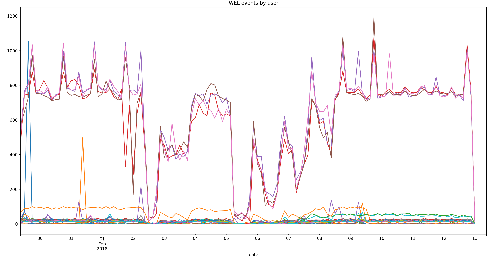

# Lateral Movements

## Context
In the field of cybersecurity, *lateral movements* occur when an account
has been compromised and privilege escalation occurs, thus allowing
the intruder penetrate systems, networks or functionalities in a non-legitimate way.

In order to detect this kind of attacks, some tests are executed
following the Cyber Kill Chain phases but starting from the Discovery 
phase (Obviating the motive phase). These tests have been performed 
on the machines of an Active Directory laboratory, pivoting on them
when it has been necessary

    

In this document, the results will be analyzed in the form of
time series created from Windows Event Log events.

## Windows Event Log
Windows Event Log is a record of alerts and notifications from a computer.
As defined by Microsoft, it is: *"any significant occurrence in the system
or in a program that requires users to be notified or an entry added to a log. "*.

Among the fields that each log has, the following were considered significant:
- **Date**:  Date on which the event occurred.
- **Time**: Time at which the event occurred.
- **User**:  The username of the account that was logged on when the event occurred
- **Event ID**:  Windows identifier that specifies the type of event

The following events are collected: 4634, 4729, 4728, 4724, 4727, 
4726, 4720, 4722, 4730, 4776, 4624, 4625, 4771, 4732, 4733, 4648, 4731, 4737, 
4734, 4735, 4738, 4647 y 4688.

## Data sources

The data is collected from a query to InfluxDB, which returns a JSON.
This JSON is transformed to a Pandas DataFrame in order to analyze it in with more detail.o con mayor detalle.

## User Behaviour Analytics

According to Gartner, UBA is a cybersecurity process for the detection of
  internal threats, targeted attacks and financial fraud.
UBA solutions are based on patterns that describe human behavior,
applying algorithms and statistical analysis to detect abnormal patterns.

## Time series
 
To analyze the users behavior on Windows computers, events are grouped per
 user and the number of events that occur in three-hour ranges.When one
 proceeds to visualize them, it is observed that there are two clear patterns.
  There are 4 users with much greater activity than the rest.

    

If the users with less activity are displayed, several peaks are observed that
reach the most active users.

    

## User Behaviour

To determine the user's normal behavior, an algorithm must be used that allows 
them to be grouped according to their behavior in an unsupervised way. 
In this case we have chosen to use a hierarchical clustering. It labels 
the most active users and the least active users in a different cluster.

Specifically, an agglomerative type clustering is used, that is, 
each observation starts in its own group and the pairs of groups
 are mixed while one rises in the hierarchy. The similarity is 
 measured by Euclidean distance.

    

### Cluster change over time

It could be said that a user should always belong to the same cluster over time 
and that if this changed, it could be due to an anomaly.

It is verified that, if the clustering algorithm is applied in ranges of three hours,
 there is one more user that is grouped in the cluster of the most active users,
 probably because the peak decreases the Euclidean distance that separates the users.
 
#### Normal behaviour

The dendrogram resulting from the clustering at a normal time is shown below.

    

#### Abnormal behaviour

However, at the moment when the user's activity peak occurs, 
the dendrogram now includes him in the most active user group. 
This can be seen in the following graph, in which there are four 
users in the cluster of users with the highest activity, with 5 users.

    

## Conclusions

Threat detection based on behavior is the basis of UBA. 
Behavioral profiles and group analysis allow to detect threats in 
a Cyber Kill Chain. If we rely on the resulting series, it seems 
that users have similar behavior within each of the two groups.

An algorithm could be linked to learn the classification assigned to each user,
 that is, to keep a historical series with the membership of the users' clusters. 
 A change in the users could mean that some lateral movement is occurring, which 
 are critical in something as sophisticated as a Cyber Kill Chain.
 
This technique serves to reduce false positives, which are very common in 
classical algorithms for detecting anomalies in time series.

However, the data collected is from a laboratory with only four 
domain controllers, so it can not be assumed that the observed behavior is 
comparable to that of users in a production environment. 
To learn the actual behavior and make a more effective segmentation, 
the usual behavior of legitimate users should be available in a more 
realistic environment.

 
